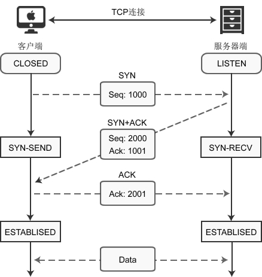

# TCP数据报结构以及三次握手

+ [TCP数据报结构](#TCP数据报结构)
+ [连接的建立](#连接的建立)
+ [最后的说明](#最后的说明)

TCP（Transmission Control Protocol，传输控制协议）是一种面向连接的、可靠的、基于字节流的通信协议，数据在传输前要建立连接，传输完毕后还要断开连接。

客户端在收发数据前要使用 connect() 函数和服务器建立连接。建立连接的目的是保证IP地址、端口、物理链路等正确无误，为数据的传输开辟通道。

TCP建立连接时要传输三个数据包，俗称三次握手（Three-way Handshaking）。可以形象的比喻为下面的对话：
+ [Shake 1] 套接字A：“你好，套接字B，我这里有数据要传送给你，建立连接吧。”
+ [Shake 2] 套接字B：“好的，我这边已准备就绪。”
+ [Shake 3] 套接字A：“谢谢你受理我的请求。”

## TCP数据报结构
我们先来看一下TCP数据报的结构：

带阴影的几个字段需要重点说明一下：
1) 序号：Seq（Sequence Number）序号占32位，用来标识从计算机A发送到计算机B的数据包的序号，计算机发送数据时对此进行标记。

2) 确认号：Ack（Acknowledge Number）确认号占32位，客户端和服务器端都可以发送，Ack = Seq + 1。

3) 标志位：每个标志位占用1Bit，共有6个，分别为 URG、ACK、PSH、RST、SYN、FIN，具体含义如下：
+ URG：紧急指针（urgent pointer）有效。
+ ACK：确认序号有效。
+ PSH：接收方应该尽快将这个报文交给应用层。
+ RST：重置连接。
+ SYN：建立一个新连接。
+ FIN：断开一个连接。

`对英文字母缩写的总结：Seq 是 Sequence 的缩写，表示序列；Ack(ACK) 是 Acknowledge 的缩写，表示确认；SYN 是 Synchronous 的缩写，愿意是“同步的”，这里表示建立同步连接；FIN 是 Finish 的缩写，表示完成。`

## 连接的建立
连接的建立（三次握手）
使用 connect() 建立连接时，客户端和服务器端会相互发送三个数据包，请看下图：

客户端调用 socket() 函数创建套接字后，因为没有建立连接，所以套接字处于CLOSED状态；服务器端调用 listen() 函数后，套接字进入LISTEN状态，开始监听客户端请求。

这个时候，客户端开始发起请求：
1) 当客户端调用 connect() 函数后，TCP协议会组建一个数据包，并设置 SYN 标志位，表示该数据包是用来建立同步连接的。同时生成一个随机数字 1000，填充“序号（Seq）”字段，表示该数据包的序号。完成这些工作，开始向服务器端发送数据包，客户端就进入了SYN-SEND状态。

2) 服务器端收到数据包，检测到已经设置了 SYN 标志位，就知道这是客户端发来的建立连接的“请求包”。服务器端也会组建一个数据包，并设置 SYN 和 ACK 标志位，SYN 表示该数据包用来建立连接，ACK 用来确认收到了刚才客户端发送的数据包。

服务器生成一个随机数 2000，填充“序号（Seq）”字段。2000 和客户端数据包没有关系。

服务器将客户端数据包序号（1000）加1，得到1001，并用这个数字填充“确认号（Ack）”字段。

服务器将数据包发出，进入SYN-RECV状态。

3) 客户端收到数据包，检测到已经设置了 SYN 和 ACK 标志位，就知道这是服务器发来的“确认包”。客户端会检测“确认号（Ack）”字段，看它的值是否为 1000+1，如果是就说明连接建立成功。

接下来，客户端会继续组建数据包，并设置 ACK 标志位，表示客户端正确接收了服务器发来的“确认包”。同时，将刚才服务器发来的数据包序号（2000）加1，得到 2001，并用这个数字来填充“确认号（Ack）”字段。

客户端将数据包发出，进入ESTABLISED状态，表示连接已经成功建立。

4) 服务器端收到数据包，检测到已经设置了 ACK 标志位，就知道这是客户端发来的“确认包”。服务器会检测“确认号（Ack）”字段，看它的值是否为 2000+1，如果是就说明连接建立成功，服务器进入ESTABLISED状态。

至此，客户端和服务器都进入了ESTABLISED状态，连接建立成功，接下来就可以收发数据了。

## 最后的说明
三次握手的关键是要确认对方收到了自己的数据包，这个目标就是通过“确认号（Ack）”字段实现的。计算机会记录下自己发送的数据包序号 Seq，待收到对方的数据包后，检测“确认号（Ack）”字段，看Ack = Seq + 1是否成立，如果成立说明对方正确收到了自己的数据包。